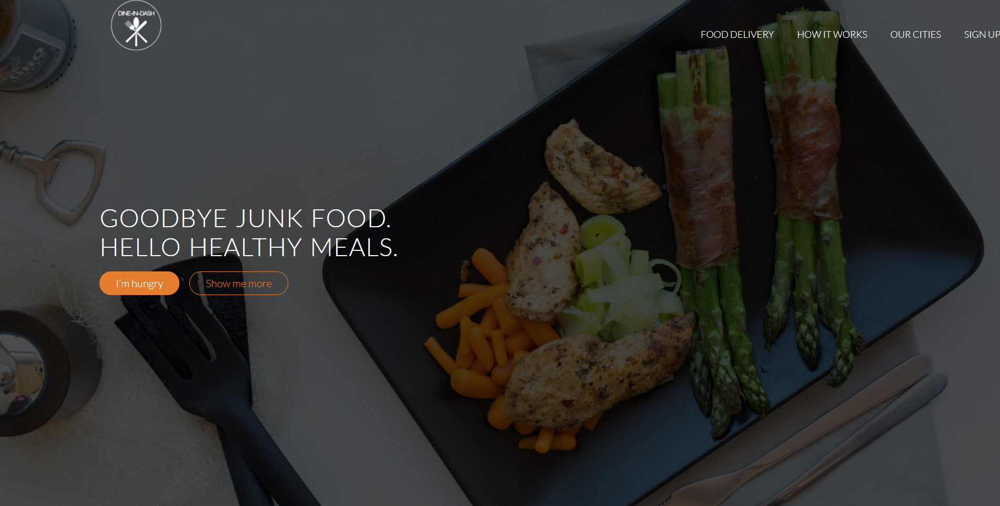

# Dine-In-Dash

Dine-In-Dash is a single page application with responsive animated images. Uses Google Map API in contact form to show mock base location of company.

 Responsive interactive buttons, hover states and animations built with Bootstrap.
 
 **See the hosted project [here](zeniagist.github.io/dine-in-dash/).**

### Author

[Zenia Gist](https://zeniagist.github.io)

### Version

1.0.0
